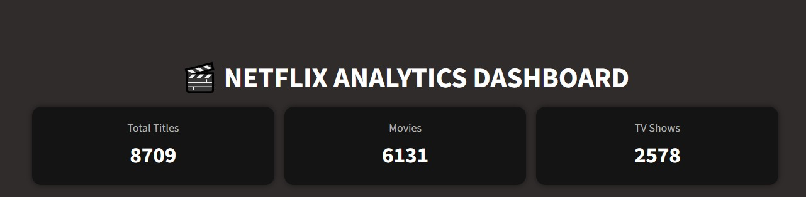
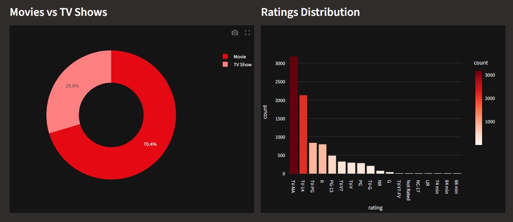
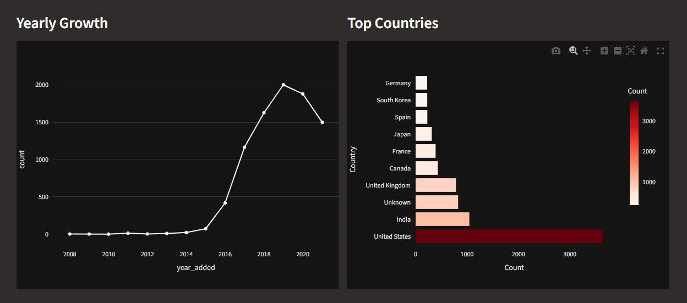
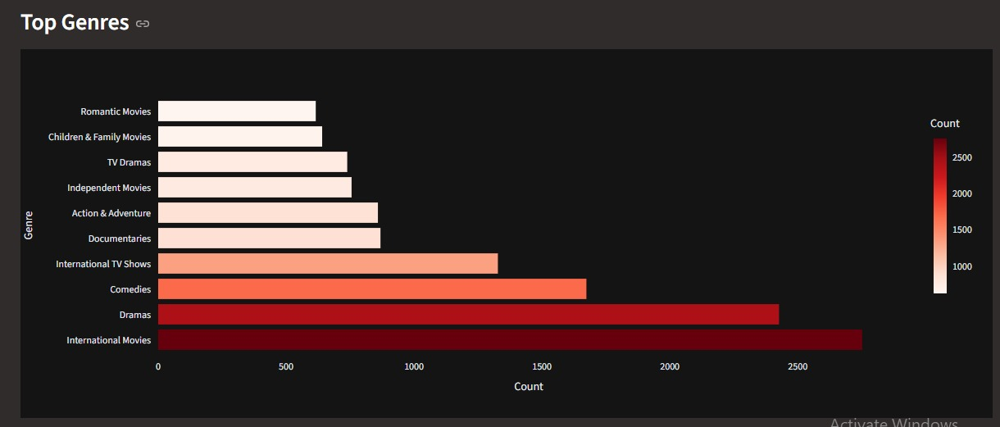

# Netflix-dashboard-
Netflix Dashboard is an interactive data analysis project built using Python, Pandas, and Streamlit. It processes Netflix dataset to uncover insights on genres, ratings, and content trends through dynamic visualizations using Matplotlib and Plotly, enabling users to explore and understand streaming data effectively.
## 📊 Dashboard Preview

